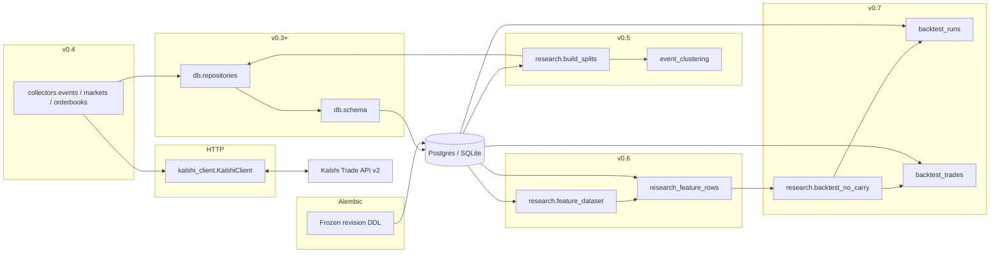
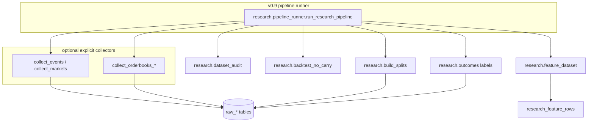
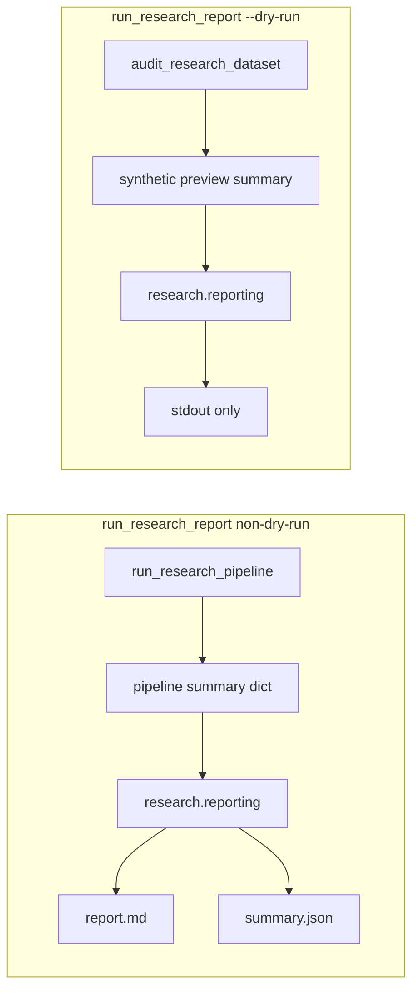

# Architecture (v0.12 — collectors + pipeline + reporting + orderbook audit + splits + features + labels + audit + backtest + Alembic)

## Purpose

This codebase supports **offline research** for a Kalshi thesis around **NO** contracts: identify potential mispricing after costs (fees, spread), ambiguity, and correlation — **without live trading**.

**v0.5** adds **deterministic clustering and splits** on top of **v0.4** collectors. **v0.6** adds **`research_feature_rows`**. **v0.7** adds the **read-only backtest harness** (`backtest_runs` / `backtest_trades`). **v0.8** adds **`research_market_labels`** from **`raw_markets`** (`research/outcomes.py`), optional merge into feature rows via **`--label-version`**, and **`research/dataset_audit.py`** for coverage metrics. **v0.9** adds **`research/pipeline_runner.py`**: ordered orchestration (optional migrate/collectors, splits, labels, features with `label_version`, audit, optional backtest) with one safe JSON summary. **v0.10** adds **`research/reporting.py`**: Markdown + readiness **`compute_research_readiness`** from pipeline outputs (`scripts/run_research_report.py`). **v0.11** ensures **`collectors.common.normalize_collector_summary`** flattens each collector return value (dataclass, dict, or Pydantic) into a **JSON-serializable** stage payload with a consistent **`success`** bit before it is merged into **`run_research_pipeline`** output (fixes composite orderbook summaries that only exposed nested **`success`** fields). **v0.12** adds **`research/orderbook_audit.py`**: read-only inspection of **`raw_orderbook_snapshots`** (shape + implied executable NO/YES asks) to separate **empty books**, **unrecognized JSON**, and **feature-row extraction gaps**; **`run_no_carry_backtest_persisted`** completes reads and writes in **separate SQLAlchemy transactional scopes** to avoid nested **`begin()`** errors, and **replaces** any existing persisted row for the same **deterministic `run_id`** (UUIDv5 over canonical config) in **one transaction** when persisting so reruns stay idempotent. Labels support **scoring and audits**, not pricing-feature inputs.

## Process boundaries

**v0.5 research split flow:** `raw_events` + `raw_markets` → **event clustering** → `event_clusters` → **split assignment** → `strategy_splits`.

**v0.6 feature flow:** `raw_orderbook_snapshots` (with **`derive_executable_prices_from_orderbook`** at ingest) → join markets + clusters + `strategy_splits` → **`research.feature_dataset`** → **`research_feature_rows`**. **v0.12** optional **`audit_orderbook_price_extraction`** validates stored **`raw_json`** vs. columns and vs. feature rows before trusting readiness/backtests.

**v0.8 label flow:** **`raw_markets`** → **`research.outcomes`** → **`research_market_labels`** → *(optional)* merge at **`build_features.py`** into **`label_*`** on **`research_feature_rows`** → backtest **scoring** + **`dataset_audit`**.

**v0.7 backtest flow:** **`research_feature_rows`** → **`research.backtest_no_carry`** (select hypothetical NO entries, score vs **`label_*`** only) → **`backtest_runs`** + **`backtest_trades`** → *future* execution / models **not implemented here**.

**v0.9 pipeline (orchestration):** optional **`migrate` / `create_tables`** → optional **collectors** (explicit flags only) → **`build_event_clusters_from_raw_data` + `assign_chronological_splits`** → **`build_market_outcome_labels_from_raw_markets`** → **`build_research_feature_rows_pipeline`** (with **`label_version`**) → **`audit_research_dataset`** → optional **`run_no_carry_backtest_persisted`**. Implemented in **`research.pipeline_runner`**; entry CLI **`scripts/run_research_pipeline.py`**. Default invocation uses **stored DB data only** (no network). **v0.11:** **`normalize_collector_summary`** (see **`collectors/common.py`**) is applied to **`collect_orderbooks`** (and accepts the same shapes for future stages) so pipeline JSON never assumes a bespoke attribute layout on collector objects.

**v0.10 reporting:** **`run_research_pipeline`** summary → **`research.reporting.build_research_audit_report`** / **`compute_research_readiness`** → `report.md` + `summary.json` (via **`scripts/run_research_report.py`** when not **`--dry-run`**). Readiness is **conservative** and **does not** assert tradable edge.

**`--dry-run` preview:** does **not** invoke **`run_research_pipeline`**; it calls **`audit_research_dataset`** (read-only) and reporting helpers on a **synthetic in-memory** pipeline summary so no report files or DB writes occur. Write-oriented CLI flags are **ignored** and listed in stdout JSON as **`ignored_write_flags`**.

## Modules (current)

| Path | Responsibility today |
|------|----------------------|
| `kalshi_no_carry.kalshi_client` | Read-only Trade API v2 (`get_events`, `iter_events`, markets, orderbooks, status) |
| `kalshi_no_carry.collectors.*` | `collect_events`, `collect_markets`, `collect_orderbooks_*` |
| `kalshi_no_carry.database` | Engine + `create_all` / `drop_all` + `healthcheck` + URL redaction |
| `alembic/` + `scripts/db_migrate.py` | Versioned DDL via **explicit** Alembic revisions (`alembic upgrade head`); baseline `0001` is frozen `op.create_table` DDL — not `create_all` in migrations |
| `kalshi_no_carry.db.*` | ORM + idempotent upserts + snapshot insert + clustering/split **read helpers** |
| `kalshi_no_carry.research.event_clustering` | Deterministic cluster keys / ids from raw dict rows |
| `kalshi_no_carry.research.splits` | Pure chronological partition math (integer % and float fractions) |
| `kalshi_no_carry.research.build_splits` | `build_event_clusters_from_raw_data`, `assign_chronological_splits` |
| `kalshi_no_carry.research.features` | Pure deterministic primitives (mids, spreads, time-to-close, NO-carry scaffolding) |
| `kalshi_no_carry.research.feature_dataset` | `JoinedFeatureSource`, `build_feature_row_from_joined_record`, **`build_research_feature_rows_pipeline`**, validation |
| `kalshi_no_carry.research.outcomes` | Deterministic `extract_market_outcome_label*`, label builder from `raw_markets` |
| `kalshi_no_carry.research.dataset_audit` | `audit_research_dataset` coverage / join diagnostics |
| `kalshi_no_carry.research.backtest_config` | Versioned `BacktestConfig` (Pydantic) for read-only runs |
| `kalshi_no_carry.research.pipeline_runner` | v0.9 **`ResearchPipelineConfig`**, **`run_research_pipeline`**, **`recommend_next_action`** |
| `kalshi_no_carry.research.orderbook_audit` | v0.12 **`audit_orderbook_price_extraction`**: read-only orderbook JSON + executable price diagnostics |
| `kalshi_no_carry.research.backtest_no_carry` | Candidate selection, `score_no_trade`, summaries; **`run_no_carry_backtest_persisted`** |
| `scripts/build_splits.py` | CLI: materialize clusters + splits (requires `DATABASE_URL`) |
| `scripts/run_research_pipeline.py` | CLI: full pipeline, JSON summary (test excluded by default) |
| `scripts/run_research_report.py` | CLI: pipeline + Markdown/JSON audit report + readiness; **`--dry-run`** = audit-only preview, no files / no DB writes |
| `scripts/build_labels.py` | CLI: populate `research_market_labels` |
| `scripts/build_features.py` | CLI: build / persist `research_feature_rows` (test excluded by default) |
| `scripts/audit_orderbook_prices.py` | CLI: read-only orderbook price audit JSON |
| `scripts/run_backtest.py` | CLI: load feature rows, run baseline NO-carry rules, optional persist |

## Ingestion design

- **Synchronous** loops; optional `sleep_seconds` between orderbook fetches to be polite.
- **One `api_fetch_log` row per successful page** (events/markets) **or per orderbook attempt** (success or failure after rollback).
- **Orderbook rows** are always **inserted** (append-only snapshots); executable bests come from `derive_executable_prices_from_orderbook()`.
- **Split builder** is **read-only** with respect to Kalshi: it only reads the database.

## What is explicitly deferred

- **Live** order placement, portfolio, and execution against Kalshi  
- Model training and calibrated **probability** models  
- Automated **strategy selection** based on test-set peeking  

See `DATA_SCHEMA.md` and `RESEARCH_RULES.md`.
