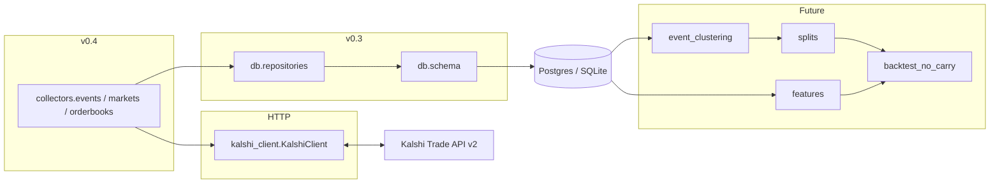

# Architecture (v0.4 read-only collectors)

## Purpose

This codebase supports **offline research** for a Kalshi thesis around **NO** contracts: identify potential mispricing after costs (fees, spread), ambiguity, and correlation — **without live trading**.

Version **0.4** adds **read-only collectors** that combine **`KalshiClient`** with **`db.repositories`** to populate `raw_events`, `raw_markets`, `raw_orderbook_snapshots`, and `api_fetch_log`. Clustering, split materialization, features, and backtests remain **out of scope**.

## Process boundaries

## Modules (current)

| Path | Responsibility today |
|------|----------------------|
| `kalshi_no_carry.kalshi_client` | Read-only Trade API v2 (`get_events`, `iter_events`, markets, orderbooks, status) |
| `kalshi_no_carry.collectors.common` | `CollectorSummary`, `OrderbookCollectionSummary`, safe error strings |
| `kalshi_no_carry.collectors.events` | `collect_events` |
| `kalshi_no_carry.collectors.markets` | `collect_markets` |
| `kalshi_no_carry.collectors.orderbooks` | `collect_orderbooks_for_markets`, `collect_orderbooks_for_active_markets` |
| `kalshi_no_carry.database` | Engine + DDL + `healthcheck` + URL redaction |
| `kalshi_no_carry.db.*` | ORM + idempotent upserts + snapshot insert |
| `kalshi_no_carry.collectors.candles` (etc.) | **Stubs** — not used in v0.4 |
| `kalshi_no_carry.research.*` (except splits) | **Stubs** |

## Ingestion design

- **Synchronous** loops; optional `sleep_seconds` between orderbook fetches to be polite.
- **One `api_fetch_log` row per successful page** (events/markets) **or per orderbook attempt** (success or failure after rollback).
- **Orderbook rows** are always **inserted** (append-only snapshots); executable bests come from `derive_executable_prices_from_orderbook()`.
- **CLI scripts** (`collect_markets.py`, `collect_orderbooks.py`, `collect_snapshot.py`) require **`DATABASE_URL`**; they print **`to_public_dict()`** summaries only (no full ticker lists, no secrets).

## What is explicitly deferred

- Event clustering, `build_splits` persistence, feature pipelines, NO-carry backtester  
- Order placement, portfolio, execution  
- Alembic migrations (still `create_all` for v0.3+ DDL)

See `DATA_SCHEMA.md` and `RESEARCH_RULES.md`.
