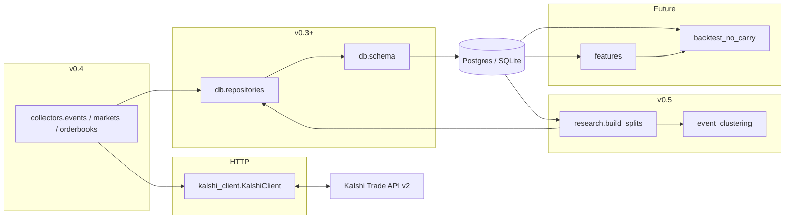

# Architecture (v0.5 — collectors + research split layer)

## Purpose

This codebase supports **offline research** for a Kalshi thesis around **NO** contracts: identify potential mispricing after costs (fees, spread), ambiguity, and correlation — **without live trading**.

Version **0.5** adds a **deterministic clustering and split** layer on top of **v0.4** read-only collectors. Raw tables feed **event clusters**; clusters receive **train / validation / test** assignments stored in **`strategy_splits`**. Feature pipelines and backtests remain **out of scope** for this release.

## Process boundaries

**v0.5 research split flow:** `raw_events` + `raw_markets` → deterministic **event clustering** → `event_clusters` → chronological **split assignment** → `strategy_splits` (v0.5.1+: composite key `(cluster_id, split_version)` so multiple versions can coexist).

## Modules (current)

| Path | Responsibility today |
|------|----------------------|
| `kalshi_no_carry.kalshi_client` | Read-only Trade API v2 (`get_events`, `iter_events`, markets, orderbooks, status) |
| `kalshi_no_carry.collectors.*` | `collect_events`, `collect_markets`, `collect_orderbooks_*` |
| `kalshi_no_carry.database` | Engine + DDL + `healthcheck` + URL redaction |
| `kalshi_no_carry.db.*` | ORM + idempotent upserts + snapshot insert + clustering/split **read helpers** |
| `kalshi_no_carry.research.event_clustering` | Deterministic cluster keys / ids from raw dict rows |
| `kalshi_no_carry.research.splits` | Pure chronological partition math (integer % and float fractions) |
| `kalshi_no_carry.research.build_splits` | `build_event_clusters_from_raw_data`, `assign_chronological_splits` |
| `scripts/build_splits.py` | CLI: materialize clusters + splits (requires `DATABASE_URL`) |

## Ingestion design

- **Synchronous** loops; optional `sleep_seconds` between orderbook fetches to be polite.
- **One `api_fetch_log` row per successful page** (events/markets) **or per orderbook attempt** (success or failure after rollback).
- **Orderbook rows** are always **inserted** (append-only snapshots); executable bests come from `derive_executable_prices_from_orderbook()`.
- **Split builder** is **read-only** with respect to Kalshi: it only reads the database.

## What is explicitly deferred

- Feature pipelines, NO-carry backtester  
- Order placement, portfolio, execution  
- Alembic migrations (still `create_all` for DDL)

See `DATA_SCHEMA.md` and `RESEARCH_RULES.md`.
