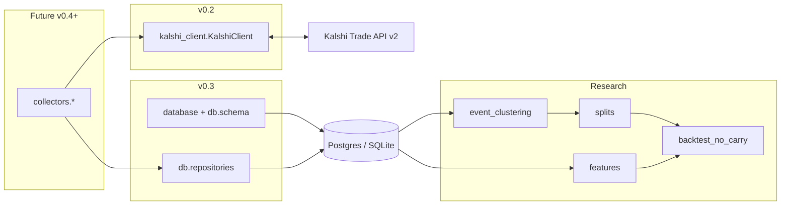

# Architecture (v0.3 persistence layer)

## Purpose

This codebase supports **offline research** for a Kalshi thesis around **NO** contracts: identify potential mispricing after costs (fees, spread), ambiguity, and correlation — **without live trading**.

Version **0.3** adds a **SQLAlchemy 2.0 persistence layer** (PostgreSQL in production, SQLite in-memory in unit tests): normalized tables for raw events/markets, order-book snapshots with executable bests, API fetch audit log, event clusters, and strategy split assignments. **`KalshiClient`** (v0.2) is unchanged in role: collectors will call it in a later version; **collectors are still stubs.**

## Process boundaries

## Modules (current)

| Path | Responsibility today |
|------|----------------------|
| `kalshi_no_carry.config` | Env-driven settings (`KALSHI_*`, optional `DATABASE_URL` as string) |
| `kalshi_no_carry.database` | Engine helpers, `redact_database_url`, `create_all_tables`, `drop_all_tables`, `healthcheck` |
| `kalshi_no_carry.db.schema` | ORM models (`api_fetch_log`, `raw_*`, `event_clusters`, `strategy_splits`) |
| `kalshi_no_carry.db.repositories` | Idempotent upserts + snapshot insert (no HTTP) |
| `kalshi_no_carry.logging_setup` | Shared logging setup for scripts |
| `kalshi_no_carry.kalshi_client` | Read-only Trade API v2 client + executable orderbook helper |
| `kalshi_no_carry.utils.fees` | Taker-fee estimator |
| `kalshi_no_carry.utils.time` | UTC helpers |
| `kalshi_no_carry.research.splits` | Pure chronological 60/20/20 split (in-memory helper) |
| `kalshi_no_carry.collectors.*` | **Stubs** — will call `KalshiClient` + repositories |
| `kalshi_no_carry.research.*` (except splits) | **Stubs** |
| `kalshi_no_carry.models.schemas` | Minimal Pydantic models |

## Database layer (v0.3)

- **Engine factory:** `create_engine_from_database_url()` — in-memory SQLite uses `StaticPool`; `PRAGMA foreign_keys=ON` for SQLite so `strategy_splits` FK tests match production intent.
- **DDL:** `Base.metadata.create_all()` / `drop_all()` — **Alembic not wired yet.**
- **JSON:** portable `JSON` with `JSONB` on PostgreSQL for `raw_json` / `params_json`.
- **Repositories:** session-scoped functions (select-then-insert/update for cross-dialect idempotent upserts).
- **Privacy:** `check_env` / `redact_database_url` mask passwords in URLs and sensitive query keys.

## Client layer (v0.2, unchanged)

- **HTTP:** `httpx`; **Signing:** RSA-PSS (SHA-256) for optional authenticated reads.
- **Order book:** bids-only API; synthetic asks via `derive_executable_prices_from_orderbook()`.

## What is explicitly deferred

- Collector implementations that call Kalshi and write via repositories
- Alembic migration history
- Order placement, portfolio APIs, live trading
- Event clustering logic beyond storing cluster rows
- Executable bid/ask **backtest engine**

See `DATA_SCHEMA.md` and `RESEARCH_RULES.md`.
