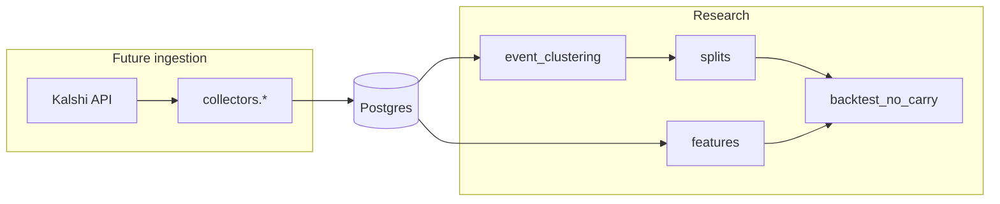

# Architecture (v0.1 scaffold)

## Purpose

This codebase supports **offline research** for a Kalshi thesis around **NO** contracts: identify potential mispricing after costs (fees, spread), ambiguity, and correlation — without live trading.

Version **0.1** is intentionally a **scaffold**: package boundaries, configuration, logging, fee/split utilities, documentation, and CLI stubs. Data collection, persistence, and simulation are **not** implemented yet.

## Process boundaries

## Modules (current)

| Path | Responsibility today |
|------|----------------------|
| `kalshi_no_carry.config` | Environment-driven settings via Pydantic |
| `kalshi_no_carry.logging_setup` | Shared logging setup for scripts |
| `kalshi_no_carry.kalshi_client` | **Stub** for future HTTP client |
| `kalshi_no_carry.database` | **Docstrings only** — Postgres later |
| `kalshi_no_carry.utils.fees` | Approximate taker-fee estimator (research-grade) |
| `kalshi_no_carry.utils.time` | UTC helpers |
| `kalshi_no_carry.research.splits` | Chronological 60/20/20 split by cluster |
| `kalshi_no_carry.collectors.*` | **Stubs** |
| `kalshi_no_carry.research.*` (except splits) | **Stubs** |
| `kalshi_no_carry.models.schemas` | Minimal Pydantic models |

## Runtime target

Designed for a **DigitalOcean VM** (or similar): Python 3.10+, environment variables for config, optional managed Postgres. No hardcoded private paths or credentials.

## What is explicitly deferred

- API authentication, signing, pagination
- DB schema, migrations, and repositories
- Event clustering logic and feature pipelines
- Executable bid/ask backtest engine
- Live order placement (out of scope for research)

See `DATA_SCHEMA.md` and `RESEARCH_RULES.md` for planned data shapes and methodological guardrails.
