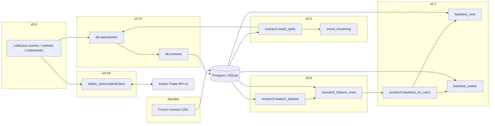

# Architecture (v0.7 — collectors + splits + feature dataset + read-only backtest + Alembic)

## Purpose

This codebase supports **offline research** for a Kalshi thesis around **NO** contracts: identify potential mispricing after costs (fees, spread), ambiguity, and correlation — **without live trading**.

**v0.5** adds **deterministic clustering and splits** on top of **v0.4** collectors. **v0.6** adds a **read-only feature dataset** layer that joins **`raw_orderbook_snapshots`** to **`raw_markets`**, **`event_clusters`**, and **`strategy_splits`**, persisting **versioned** rows in **`research_feature_rows`**. **v0.7** adds a **read-only backtest harness** that consumes those rows and optionally persists **`backtest_runs`** / **`backtest_trades`** (no live execution). Features and default exports exclude the **sealed test** split; backtests mirror that default.

## Process boundaries

**v0.5 research split flow:** `raw_events` + `raw_markets` → **event clustering** → `event_clusters` → **split assignment** → `strategy_splits`.

**v0.6 feature flow:** `raw_orderbook_snapshots` → join markets + clusters + `strategy_splits` → **`research.feature_dataset`** → **`research_feature_rows`** (versioned by `feature_version` + `split_version`).

**v0.7 backtest flow:** **`research_feature_rows`** → **`research.backtest_no_carry`** (select hypothetical NO entries, score vs **`label_*`** only) → **`backtest_runs`** + **`backtest_trades`** → *future* execution / models **not implemented here**.

## Modules (current)

| Path | Responsibility today |
|------|----------------------|
| `kalshi_no_carry.kalshi_client` | Read-only Trade API v2 (`get_events`, `iter_events`, markets, orderbooks, status) |
| `kalshi_no_carry.collectors.*` | `collect_events`, `collect_markets`, `collect_orderbooks_*` |
| `kalshi_no_carry.database` | Engine + `create_all` / `drop_all` + `healthcheck` + URL redaction |
| `alembic/` + `scripts/db_migrate.py` | Versioned DDL via **explicit** Alembic revisions (`alembic upgrade head`); baseline `0001` is frozen `op.create_table` DDL — not `create_all` in migrations |
| `kalshi_no_carry.db.*` | ORM + idempotent upserts + snapshot insert + clustering/split **read helpers** |
| `kalshi_no_carry.research.event_clustering` | Deterministic cluster keys / ids from raw dict rows |
| `kalshi_no_carry.research.splits` | Pure chronological partition math (integer % and float fractions) |
| `kalshi_no_carry.research.build_splits` | `build_event_clusters_from_raw_data`, `assign_chronological_splits` |
| `kalshi_no_carry.research.features` | Pure deterministic primitives (mids, spreads, time-to-close, NO-carry scaffolding) |
| `kalshi_no_carry.research.feature_dataset` | `JoinedFeatureSource`, `build_feature_row_from_joined_record`, validation |
| `kalshi_no_carry.research.backtest_config` | Versioned `BacktestConfig` (Pydantic) for read-only runs |
| `kalshi_no_carry.research.backtest_no_carry` | Candidate selection, `score_no_trade`, summaries (deterministic) |
| `scripts/build_splits.py` | CLI: materialize clusters + splits (requires `DATABASE_URL`) |
| `scripts/build_features.py` | CLI: build / persist `research_feature_rows` (test excluded by default) |
| `scripts/run_backtest.py` | CLI: load feature rows, run baseline NO-carry rules, optional persist |

## Ingestion design

- **Synchronous** loops; optional `sleep_seconds` between orderbook fetches to be polite.
- **One `api_fetch_log` row per successful page** (events/markets) **or per orderbook attempt** (success or failure after rollback).
- **Orderbook rows** are always **inserted** (append-only snapshots); executable bests come from `derive_executable_prices_from_orderbook()`.
- **Split builder** is **read-only** with respect to Kalshi: it only reads the database.

## What is explicitly deferred

- **Live** order placement, portfolio, and execution against Kalshi  
- Model training and calibrated **probability** models  
- Automated **strategy selection** based on test-set peeking  

See `DATA_SCHEMA.md` and `RESEARCH_RULES.md`.
